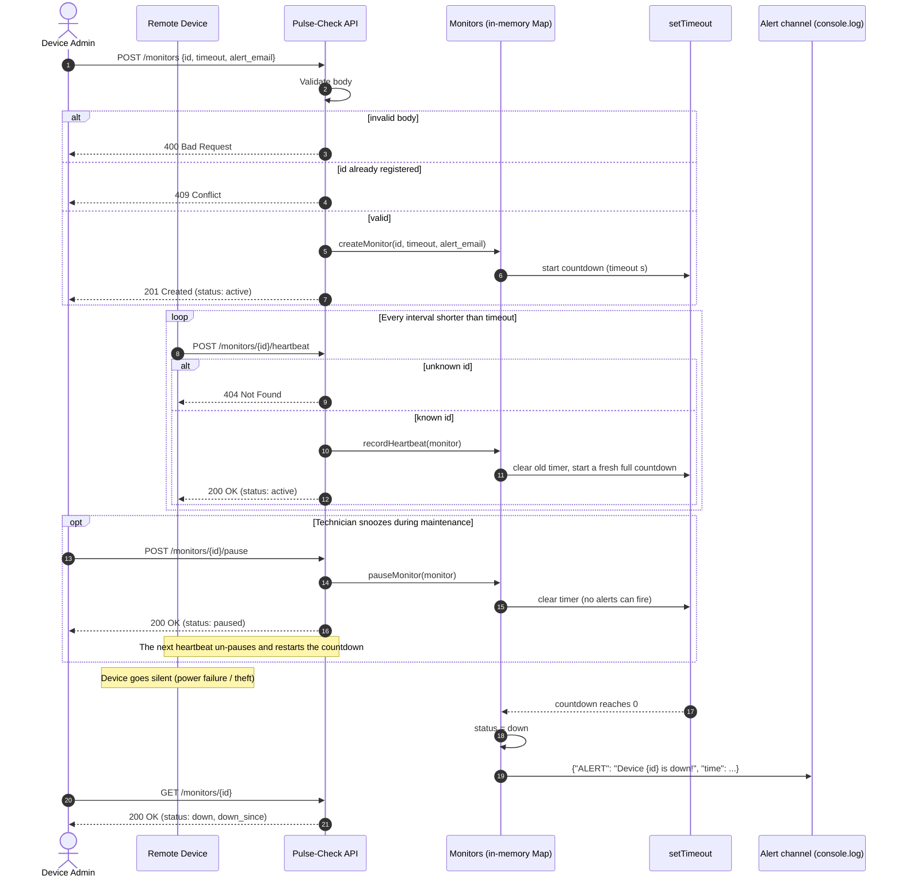
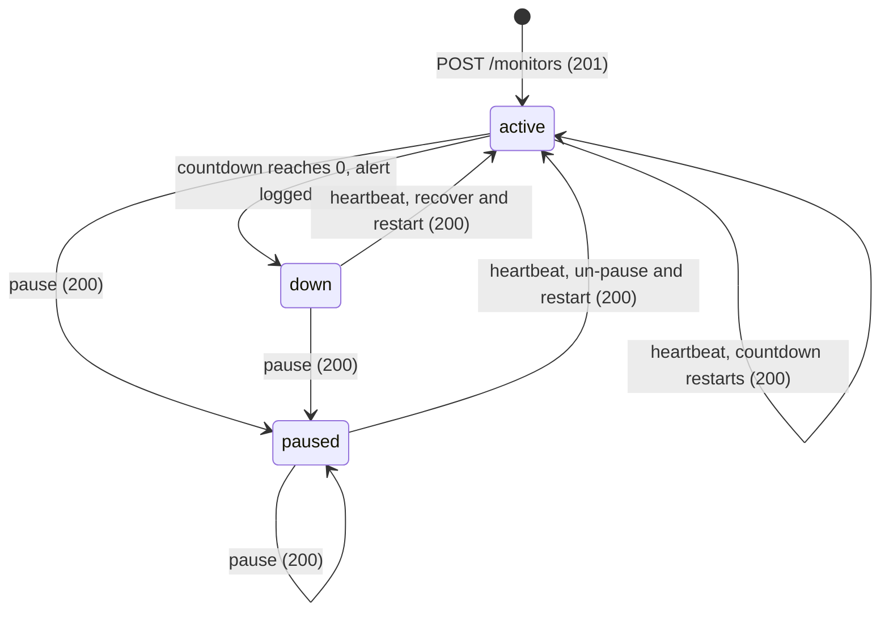

# Pulse-Check API ("Watchdog" Sentinel)

A **Dead Man's Switch API** for CritMon Servers Inc. Remote devices (solar farms, unmanned weather stations) register a monitor with a countdown timer. Every heartbeat restarts the countdown. If a device goes silent and the countdown reaches zero, the service raises an alert and marks the device `down`.

- **Runtime:** Node.js 22+ (tested on Node.js 24)
- **Dependencies:** none. It uses only Node's built-in `http` module, and tests use the built-in `node:test` runner.
- **Storage:** in memory. Each monitor holds a single `setTimeout` handle.

---

## 1. Architecture Diagram

### Sequence diagram



### Monitor state flowchart



### How the timers work

- Monitors are plain objects kept in an in-memory `Map` keyed by `id`. The `Map` is created in `src/server.js`; the functions that change a monitor are in `src/monitorStore.js`.
- An `active` monitor owns exactly **one** `setTimeout` handle. A heartbeat always calls `clearTimeout` before it schedules a new timer, so stale timers can never fire.
- **Pause** clears the timer and schedules nothing, so no alert can fire while a monitor is paused.
- **Expiry** sets the status to `down` and logs the alert as a JSON string with `console.log`.

### Project structure

```
.
├── src/
│   ├── server.js        # Entry point: creates the monitor Map and starts the HTTP server
│   ├── app.js           # Routing, request validation, JSON responses
│   └── monitorStore.js  # Monitor states, countdown timers and the alert
├── test/
│   ├── monitorStore.test.js  # Countdown logic tested with a fake clock
│   └── api.test.js           # HTTP tests against a real server
├── package.json
└── README.md
```

---

## 2. Setup Instructions

**Prerequisites:** Node.js 22 or newer. Check your version with `node -v`.

```bash
# 1. Clone your copy of the repository and enter it
git clone <repository-url>
cd <repository-folder>

# 2. Install (there are no dependencies, but this step is safe to run)
npm install

# 3. Start the server (default port 3000)
npm start
```

You should see:

```
Pulse-Check API listening on http://localhost:3000
```

To use a different port, set the `PORT` environment variable:

```bash
PORT=8080 npm start            # macOS / Linux / Git Bash
$env:PORT=8080; npm start      # Windows PowerShell
```

**Run the tests:**

```bash
npm test
```

Alerts appear in the server's terminal (stdout) as one JSON line each:

```
{"ALERT":"Device device-123 is down!","time":"2026-09-17T11:31:24.337Z"}
```

---

## 3. API Documentation

Base URL: `http://localhost:3000`

All request and response bodies are JSON. Errors always look like `{ "error": "<message>" }`.

| Method | Endpoint                     | Description                                        | Success | Errors             |
|--------|------------------------------|----------------------------------------------------|---------|--------------------|
| POST   | `/monitors`                  | Register a monitor and start its countdown         | `201`   | `400`, `409`       |
| POST   | `/monitors/{id}/heartbeat`   | Restart the countdown (also un-pauses or recovers) | `200`   | `404`              |
| POST   | `/monitors/{id}/pause`       | Stop the countdown completely (snooze)             | `200`   | `404`              |
| GET    | `/monitors/{id}`             | Get the monitor's status (Developer's Choice)      | `200`   | `404`              |

Unknown routes, and known paths called with a different HTTP method, return `404` with `{ "error": "Route not found." }`.

### The monitor object

Every successful response includes the monitor in this shape:

| Field               | Type             | Description                                                       |
|---------------------|------------------|-------------------------------------------------------------------|
| `id`                | string           | Device / monitor identifier                                       |
| `status`            | string           | `active`, `paused` or `down`                                      |
| `timeout`           | number           | Countdown length in seconds                                       |
| `alert_email`       | string           | Contact address for this device                                   |
| `last_heartbeat_at` | ISO 8601 \| null | When the last heartbeat arrived (`null` if none yet)              |
| `expires_at`        | ISO 8601 \| null | When the countdown hits zero (`null` if paused or down)           |
| `time_remaining`    | number \| null   | Seconds left on the countdown (`null` if paused or down)          |
| `down_since`        | ISO 8601 \| null | When the monitor expired (`null` unless `down`)                   |

---

### `POST /monitors`: register a monitor

Creates a monitor and immediately starts a countdown of `timeout` seconds.

**Body**

| Field         | Type   | Rules                                                                   |
|---------------|--------|-------------------------------------------------------------------------|
| `id`          | string | Required. Must not be blank, and must be unique.                        |
| `timeout`     | number | Required. Seconds, greater than `0` and at most `2147483` (~24.8 days). |
| `alert_email` | string | Required. Must be a valid email address.                                |

**Example request**

```bash
curl -i -X POST http://localhost:3000/monitors \
  -H "Content-Type: application/json" \
  -d '{"id": "device-123", "timeout": 60, "alert_email": "admin@critmon.com"}'
```

**`201 Created`**

```json
{
  "message": "Monitor 'device-123' registered. 60-second countdown started.",
  "monitor": {
    "id": "device-123",
    "status": "active",
    "timeout": 60,
    "alert_email": "admin@critmon.com",
    "last_heartbeat_at": null,
    "expires_at": "2026-09-17T11:31:24.337Z",
    "time_remaining": 60,
    "down_since": null
  }
}
```

**Errors**

- `400 Bad Request`: the body is not valid JSON, or a field is missing or invalid. Example: `{ "error": "\"timeout\" must be a number of seconds greater than 0 and at most 2147483." }`
- `409 Conflict`: a monitor with this `id` already exists. Example: `{ "error": "Monitor 'device-123' already exists." }`

---

### `POST /monitors/{id}/heartbeat`: send a heartbeat

Restarts the countdown from the full `timeout`. No request body is needed.

- On an **active** monitor, this resets the timer.
- On a **paused** monitor, this un-pauses it and restarts the timer.
- On a **down** monitor, this marks it `active` again and restarts the timer.

**Example request**

```bash
curl -i -X POST http://localhost:3000/monitors/device-123/heartbeat
```

**`200 OK`**

```json
{
  "message": "Heartbeat received. 60-second countdown restarted.",
  "monitor": {
    "id": "device-123",
    "status": "active",
    "timeout": 60,
    "alert_email": "admin@critmon.com",
    "last_heartbeat_at": "2026-09-17T11:30:24.562Z",
    "expires_at": "2026-09-17T11:31:24.562Z",
    "time_remaining": 60,
    "down_since": null
  }
}
```

The message starts with `Heartbeat received.`, `Heartbeat received. Monitor un-paused.` or `Heartbeat received. Monitor recovered from down.`, depending on the monitor's status before the heartbeat.

**Errors**

- `404 Not Found`: `{ "error": "Monitor 'device-123' not found." }`

---

### `POST /monitors/{id}/pause`: snooze a monitor

Stops the countdown completely. No alert fires while the monitor is paused. The next heartbeat un-pauses the monitor and restarts the countdown. No request body is needed.

**Example request**

```bash
curl -i -X POST http://localhost:3000/monitors/device-123/pause
```

**`200 OK`**

```json
{
  "message": "Monitor 'device-123' paused. No alerts will fire until the next heartbeat.",
  "monitor": {
    "id": "device-123",
    "status": "paused",
    "timeout": 60,
    "alert_email": "admin@critmon.com",
    "last_heartbeat_at": "2026-09-17T11:30:24.562Z",
    "expires_at": null,
    "time_remaining": null,
    "down_since": null
  }
}
```

**Errors**

- `404 Not Found`: `{ "error": "Monitor 'device-123' not found." }`

---

### `GET /monitors/{id}`: get monitor status *(Developer's Choice)*

Returns the monitor's current state without changing it.

**Example request**

```bash
curl -i http://localhost:3000/monitors/device-123
```

**`200 OK`** (after the device missed its heartbeat)

```json
{
  "id": "device-123",
  "status": "down",
  "timeout": 60,
  "alert_email": "admin@critmon.com",
  "last_heartbeat_at": "2026-09-17T11:30:24.562Z",
  "expires_at": null,
  "time_remaining": null,
  "down_since": "2026-09-17T11:31:24.563Z"
}
```

**Errors**

- `404 Not Found`: `{ "error": "Monitor 'device-123' not found." }`

---

### The alert

When a countdown reaches zero, the service logs one JSON object to stdout with `console.log` and sets the monitor's status to `down`:

```json
{"ALERT": "Device device-123 is down!", "time": "2026-09-17T11:31:24.563Z"}
```

`time` is an ISO 8601 UTC timestamp. The alert fires **once** per expiry. It fires again only if the device recovers with a heartbeat and then goes silent again.

### Behaviour notes

- **In-memory state:** monitors are not persisted. Restarting the server clears them.
- **Heartbeat on a `down` monitor:** a device that comes back online is treated as recovered. The monitor becomes `active` and its countdown restarts.
- **Pause on a `down` monitor:** allowed. The monitor becomes `paused` until the next heartbeat, so a technician can mark a failed device as under repair.
- **Pausing twice** is harmless and returns `200` again.
- **Special characters in ids:** URL-encode the id in the path. For example, the id `solar farm/7` becomes `/monitors/solar%20farm%2F7`.
- **Timeout limit:** the maximum timeout is `2147483` seconds, because that is the longest delay JavaScript's `setTimeout` can schedule. Longer values would fire immediately, so they are rejected.

---

## 4. The Developer's Choice: `GET /monitors/{id}` status endpoint

### What it is

A read-only endpoint that returns a monitor's live state: `status` (`active` / `paused` / `down`), `time_remaining`, `expires_at`, `last_heartbeat_at` and `down_since`.

### Why I added it

The brief says a monitor's status **changes to `down`** when its countdown expires, but it doesn't give anyone a way to *see* that status. Without a status endpoint:

- **Support engineers can't confirm an outage.** A line in a log stream is easy to miss, and a log can't tell you whether the device is *still* down or has since recovered. `down_since` shows how long a device has been offline, which helps the team prioritise repairs.
- **Technicians can't check a snooze.** After calling `/pause`, a technician has no way to confirm the device is actually paused, or to check that it is `active` again after repairs.
- **Admins can't see how close a device is to alerting.** `time_remaining` shows whether a device on a flaky connection is barely making its heartbeats, before it trips an alert.
- **Anything else would have to guess.** Dashboards and on-call tools can poll this endpoint instead of parsing logs.

The endpoint doesn't change any state. It reuses the same monitor object that the other endpoints return, so it adds no new state or storage. It makes the `down` state that the brief requires something people can actually check.
